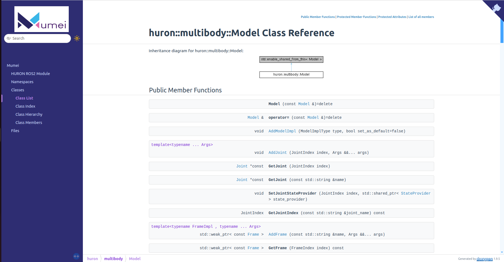

# Mumei
Modular Universal Middleware for Enhanced Integration

[](https://github.com/ALMaSWPI/huron/releases/latest)


<div class="title_screenshot">



</div>

**Mumei** is an open-source full-stack framework for any rigid-body robot.

## Introduction
In order to help researchers and students in implementing their research/work in software environment, Mumei is made to provide a generalize solution for all rigid-body robots. 
Our framework saves time for researchers/students on researching how to use a new technology in robotics software and aim to establish a set of standards and best practices for robotic development. 
By providing guidelines, libraries, and toolkits, the framework ensures that developers do not need to 'reinvent the wheel' for common tasks. This not only improves the efficiency and quality of development but also ensures that different projects can easily share and integrate each other's work.
On the other hand, our full-stack framework also benefits the robotics open-source community and provide educational value for students, researchers and roboticists.


## Features

Modularity and abstraction are at the core of this framework. Our API ensures that the application code is stable while the underlying implementation/external library can be switched flexibly. 

- 🚄 Fast and convenient with just a Docker image
- 🌈 Clean with automated CI/CD process
- 🚀 Can be integrated with any rigid-body robots
- 🧩 No need to modify any internal code when using new external tools
- 🔌 Can plug in any robotics simulation environment
- 📑 Examples are provided clearly and easy to reuse
- 🌘 Dark mode support on our documentation page!
- 🐐 Goated!

## Current supported third parties
These are all current external plugins that are implemented in the framework. For other APIs/tools that are not in the list, feel free to use our framework and follow one of our examples to build it your own.
- Kinematics and math: [Pinocchio](https://stack-of-tasks.github.io/pinocchio/), [Eigen](https://eigen.tuxfamily.org/index.php?title=Main_Page)
- Robotics simulation: [Gazebo](https://gazebosim.org/home), [MuJoCo](https://mujoco.readthedocs.io/)
- Robotics middleware: [ROS2 Humble](https://docs.ros.org/en/humble/index.html)
- Hardware-related APIs: [ODrive](https://stack-of-tasks.github.io/pinocchio/), [libsocketcan](https://lalten.github.io/libsocketcan/)

## Examples
Here is a simple example that used our framework on a humanoid called HURON. 
After the controller are implemented on the user's side, they can easily set up the framework and choose whatever simulation environment they want.

# Getting Started
In order to use our framework, there are two ways to run `mumei`: using the prebuilt Docker image or building from source.

---

## 1. Running with Docker:

### Prerequisites:
- Docker Engine/Desktop
- Computer with amd64 or arm64 chip

### Steps:
1. Pull the image:
```
sudo docker pull wpimumei/mumei:<tag>
```
Currently, `<tag>` can only be a pull request (e.g. `pr-72`).

2. Run the container in interactive mode:
```
sudo docker run -it --network=host wpimumei/mumei:<tag>
```
The option `--network=host` is needed to expose the network interfaces (including CAN) to the container.

3. To build and run an example code:

First, `cd` into a sepecific example folder in `examples`, e.g. `examples/test_robot_api`.
Each example code is a normal CMake project. To build the code:
```
mkdir build && cd build
cmake ..
make
```

If everything is correct, the binary will be built in `build` folder, which is ready to be executed.

---

## 2. Building from source:

Clone the main repo and all submodules: 
```
git clone git@github.com:wpi-mumei/mumei.git --recurse-submodules
```

### Prerequisites:

1. ARM toolchains:
```
sudo apt update
sudo apt install gcc-aarch64-linux-gnu g++-aarch64-linux-gnu
```
2. Build and install third-party CAN library
```
cd third_party/libsockcanpp
mkdir build
cd build
cmake .. -DCMAKE_TOOLCHAIN_FILE=../../../tools/<x86_64 or arm64>-toolchain.cmake -DBUILD_SHARED_LIBS=ON
make
sudo make install
```
3. Build and install third-party Serial library
```
cd third_party/serial
mkdir build
cd build
cmake .. -DCMAKE_TOOLCHAIN_FILE=../../../tools/<x86_64 or arm64>-toolchain.cmake -DBUILD_SHARED_LIBS=ON
make
sudo make install
```
4. Build and install Mujoco (if needed)
```
//Install glfw
//Install Mujoco from source. Follow instruction at https://mujoco.readthedocs.io/en/stable/programming/index.html
```
## Build and install:

1. Make sure you are in the root of this repo (`mumei/`)
2. Create `build` folder
```
mkdir build
```
3. Build the project
```
cd build
cmake .. [-DBUILD_TYPE=<build-type>] [-DUSE_PINOCCHIO=1]
make
```
4. Install `mumei`
```
sudo make install
```

Notes: 

- Currently, the project can be built on Linux only
- By default, the project builds for Raspberry Pi 64-bit (arm64). To change platform,
`BUILD_TYPE` needs to be changed. For example, on Linux x86_64: `-DBUILD_TYPE=x86_64`

---


## Uninstall:

```
cd build
sudo make uninstall
```


# Contributing and questions
Since Mumei is an open-source framework, we welcome community engagement: questions, requests for help, bug reports and feature requests.
For questions and requests, you can reach out to us by our ALMaS research group or directly to the original contributors.
